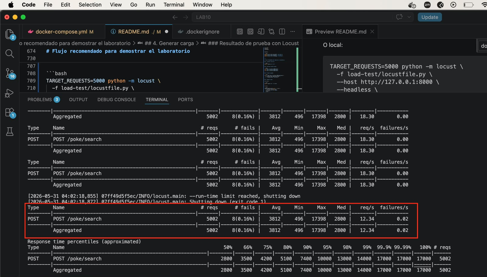

# Monitor Mach - Laboratorio 10 Arquitectura de Software

Proyecto backend basado en microservicios para consultar información de Pokémon, generar logs distribuidos, ejecutar pruebas de carga y procesar métricas mediante un bot/CLI.

El sistema implementa una arquitectura donde una API principal llamada `search-api` orquesta llamadas a:

- PokeAPI externa
- `poke-stats-service`
- `poke-images-service`

Además, cada microservicio genera sus propios logs con una nomenclatura estándar para luego ser procesados por `monitor-bot`.

---

## Arquitectura

```txt
Cliente / Load Test
        |
        v
POST /poke/search
        |
        v
Search API
   |-----------------------> PokeAPI externa
   |
   |-----------------------> Poke Stats Service ---> SQLite / CSV
   |
   |-----------------------> Poke Images Service --> File Server local
```

---

## Microservicios

### Search API

Servicio principal encargado de recibir la búsqueda del Pokémon y orquestar las llamadas a los demás servicios.

Puerto:

```txt
8000
```

Endpoints:

```txt
GET  /health
POST /poke/search
```

Ejemplo:

```bash
curl -X POST http://localhost:8000/poke/search \
  -H "Content-Type: application/json" \
  -d '{"pokemon_name":"charizard"}'
```

Respuesta esperada:

```json
{
  "name": "charizard",
  "pokedex_id": 6,
  "types": ["fire", "flying"],
  "abilities": ["blaze", "solar-power"],
  "stats": {
    "pokedex_id": 6,
    "name": "Charizard",
    "type_1": "Fire",
    "type_2": "Flying",
    "total": 534,
    "hp": 78,
    "attack": 84,
    "defense": 78,
    "sp_attack": 109,
    "sp_defense": 85,
    "speed": 100,
    "generation": 1,
    "legendary": false
  },
  "image_url": "http://localhost:8002/static/images/charizard.png"
}
```

---

### Poke Stats Service

Microservicio encargado de devolver las estadísticas del Pokémon usando un dataset CSV cargado en SQLite.

Puerto:

```txt
8001
```

Endpoints:

```txt
GET /health
GET /stats/{pokemon_name}
```

Ejemplo:

```bash
curl http://localhost:8001/stats/charizard
```

Respuesta esperada:

```json
{
  "pokedex_id": 6,
  "name": "Charizard",
  "type_1": "Fire",
  "type_2": "Flying",
  "total": 534,
  "hp": 78,
  "attack": 84,
  "defense": 78,
  "sp_attack": 109,
  "sp_defense": 85,
  "speed": 100,
  "generation": 1,
  "legendary": false
}
```

---

### Poke Images Service

Microservicio encargado de devolver la URL de la imagen del Pokémon usando imágenes almacenadas localmente.

Puerto:

```txt
8002
```

Endpoints:

```txt
GET /health
GET /images/{pokemon_name}
```

Ejemplo:

```bash
curl http://localhost:8002/images/charizard
```

Respuesta esperada:

```json
{
  "name": "charizard",
  "image_url": "http://localhost:8002/static/images/charizard.png",
  "relative_path": "/static/images/charizard.png"
}
```

---

### Monitor Bot

CLI encargado de procesar los logs generados por los microservicios y calcular métricas.

Comandos implementados:

```txt
CheckLatency
CheckAvailability
RenderGraph
Stats
```
---

## Requisitos

Para ejecutar el proyecto se necesita:

```txt
Docker
Docker Compose
Python 3.12 o superior
```

Opcional para ejecutar scripts localmente:

```txt
pip
virtualenv o conda
```

---

## Ejecución con Docker Compose

Desde la raíz del repositorio:

```bash
docker compose up --build
```

Esto levanta:

```txt
search-api          -> http://localhost:8000
poke-stats-service  -> http://localhost:8001
poke-images-service -> http://localhost:8002
```

Para detener los servicios:

```bash
docker compose down
```

---

## Verificar servicios

En otra terminal, ejecutar:

```bash
curl http://localhost:8000/health
curl http://localhost:8001/health
curl http://localhost:8002/health
```

Respuestas esperadas:

```json
{"service":"SearchAPI","status":"UP"}
```

```json
{"service":"PokeStats","status":"UP"}
```

```json
{"service":"PokeImages","status":"UP"}
```

---

## Probar flujo completo

Ejecutar:

```bash
curl -X POST http://localhost:8000/poke/search \
  -H "Content-Type: application/json" \
  -d '{"pokemon_name":"charizard"}'
```

El resultado debe incluir:

```txt
name
pokedex_id
types
abilities
stats
image_url
```

---

## Logs distribuidos

Cada microservicio genera sus propios logs:

```txt
search-api/logs/search-api.log
poke-stats-service/logs/poke-stats-service.log
poke-images-service/logs/poke-images-service.log
```

Formato estándar:

```txt
{Fecha} {Modulo} {API} {Funcion} Message
```

Ejemplo:

```txt
2026-05-30T22:30:00.123 SearchAPI /poke/search search_pokemon START pokemon=charizard
2026-05-30T22:30:00.245 SearchAPI /poke/search search_pokemon END pokemon=charizard status=200 latency_ms=122.5
```

Los logs incluyen:

```txt
timestamp
módulo
API
función
status code
latencia en ms
mensaje del evento
```

---

## Ver logs

```bash
tail -n 20 search-api/logs/search-api.log
tail -n 20 poke-stats-service/logs/poke-stats-service.log
tail -n 20 poke-images-service/logs/poke-images-service.log
```

Contar líneas generadas:

```bash
wc -l search-api/logs/search-api.log
wc -l poke-stats-service/logs/poke-stats-service.log
wc -l poke-images-service/logs/poke-images-service.log
```

---

# Pruebas de carga

El laboratorio solicita generar entre 1000 y 10000 llamadas para producir logs.

En este proyecto se puede usar Locust o JMeter.

---

## Opción A: Locust con Docker Compose

Crear carpeta de resultados:

```bash
mkdir -p load-test/results
```

Ejecutar Locust:

```bash
docker compose run --rm locust
```

El servicio Locust ejecuta 5000 requests contra:

```txt
POST http://search-api:8000/poke/search
```

Dentro de Docker Compose se usa:

```txt
http://search-api:8000
```

Desde la máquina host se usa:

```txt
http://localhost:8000
```

---

## Opción B: Locust local

Instalar Locust:

```bash
python -m pip install -r load-test/requirements.txt
```

Ejecutar en modo headless:

```bash
TARGET_REQUESTS=5000 python -m locust \
  -f load-test/locustfile.py \
  --host http://127.0.0.1:8000 \
  --headless \
  -u 50 \
  -r 10 \
  --run-time 10m \
  --csv load-test/results/search-api-load-test
```

Parámetros:

```txt
TARGET_REQUESTS=5000  -> cantidad objetivo de requests
-u 50                 -> usuarios concurrentes
-r 10                 -> usuarios creados por segundo
--run-time 10m        -> tiempo máximo de ejecución
--csv                 -> exporta resultados
```

---

## Opción C: JMeter

Configurar un Thread Group:

```txt
Number of Threads: 50
Ramp-up period: 20
Loop Count: 100
```

Total:

```txt
50 * 100 = 5000 requests
```

HTTP Request:

```txt
Protocol: http
Server Name or IP: 127.0.0.1
Port Number: 8000
Method: POST
Path: /poke/search
```

Body Data:

```json
{
  "pokemon_name": "charizard"
}
```

Headers:

```txt
Content-Type: application/json
Accept: application/json
```

Guardar el archivo como:

```txt
load-test/search-api-load-test.jmx
```

---

# Parte II - Monitor Bot

El bot procesa los logs generados por los microservicios.

Ubicación:

```txt
monitor-bot/
```

Instalar dependencias:

```bash
cd monitor-bot
python -m pip install -r requirements.txt
```

---

## Comando: CheckLatency

Muestra la latencia promedio diaria de un módulo en un periodo determinado.

Ejemplo:

```bash
python main.py CheckLatency PokeStats --start-date 2026-05-30 --end-date 2026-05-30
```

Salida esperada:

```txt
Latency for module: PokeStats
30/05 12.45ms
```

---

## Comando: CheckAvailability

Muestra la disponibilidad del servicio durante los últimos N días.

Fórmula:

```txt
Availability = Tasa de Éxito / (Tasa de Éxito + Tasa de Error)
```

Donde:

```txt
Tasa de Éxito = requests con status 200
Tasa de Error = requests con status 500
```

Ejemplo:

```bash
python main.py CheckAvailability PokeStats --last-days 5
```

Salida esperada:

```txt
Availability for module: PokeStats
30/05 99.9%
```

---

## Comando: RenderGraph

Renderiza una gráfica en consola usando ASCII.

Ejemplo para latencia:

```bash
python main.py RenderGraph --metric Latency --module PokeStats --last-days 5
```

Ejemplo para disponibilidad:

```bash
python main.py RenderGraph --metric Availability --module PokeStats --last-days 5
```

Salida esperada:

```txt
Latency graph for PokeStats
===========================
30/05 | ████████████████████████████████████████ 12.45
```

---

## Comando: Stats

Muestra métricas generales del módulo.

Ejemplo:

```bash
python main.py Stats PokeStats --last-days 5
```

Métricas incluidas:

```txt
P95 latency
requests per minute
error ratio
throughput
top failing endpoint
total requests
success count
error count
average latency
bottleneck
retry recommendation
scaling recommendation
```

Salida esperada:

```txt
Stats for module: PokeStats
P95 latency: 25.31 ms
Requests per minute: 450.5
Error ratio: 0.0%
Throughput: 450.5 successful req/min
Top failing endpoint: N/A
Total requests: 5000
Success count: 5000
Error count: 0
Average latency: 12.45 ms

Analysis
El bottleneck parece estar en PokeStats, con latencia promedio de 12.45 ms.
No se observan errores 500. No parece necesario agregar retry por ahora.
No parece necesario escalar todavía; el servicio se mantiene estable.
```

---

## Módulos soportados por el bot

Se pueden consultar los siguientes módulos:

```txt
SearchAPI
PokeStats
PokeImages
```

Ejemplos:

```bash
python main.py Stats SearchAPI --last-days 5
python main.py Stats PokeStats --last-days 5
python main.py Stats PokeImages --last-days 5
```

---

# Flujo recomendado para demostrar el laboratorio

## 1. Levantar servicios

```bash
docker compose up --build
```

## 2. Verificar health checks

```bash
curl http://localhost:8000/health
curl http://localhost:8001/health
curl http://localhost:8002/health
```

## 3. Probar búsqueda

```bash
curl -X POST http://localhost:8000/poke/search \
  -H "Content-Type: application/json" \
  -d '{"pokemon_name":"charizard"}'
```

## 4. Generar carga

Con Locust:

```bash
docker compose run --rm locust
```

O local:

```bash
TARGET_REQUESTS=5000 python -m locust \
  -f load-test/locustfile.py \
  --host http://127.0.0.1:8000 \
  --headless \
  -u 50 \
  -r 10 \
  --run-time 10m \
  --csv load-test/results/search-api-load-test
```

### Resultado de prueba con Locust

Se ejecutó una prueba de carga contra el endpoint principal:

```txt
POST /poke/search
```




```txt
Total requests: 5002
Requests fallidas: 8
Error ratio: 0.16%
Success ratio aproximado: 99.84%
Latencia promedio: 3812 ms
Latencia mínima: 496 ms
Latencia máxima: 17398 ms
Mediana: 2800 ms
Throughput aproximado: 18.30 req/s
```


## 5. Validar logs

```bash
wc -l search-api/logs/search-api.log
wc -l poke-stats-service/logs/poke-stats-service.log
wc -l poke-images-service/logs/poke-images-service.log
```

## 6. Ejecutar bot

```bash
cd monitor-bot

python main.py CheckLatency PokeStats --start-date 2026-05-30 --end-date 2026-05-30

python main.py CheckAvailability PokeStats --last-days 5

python main.py RenderGraph --metric Latency --module PokeStats --last-days 5

python main.py Stats PokeStats --last-days 5
```

---

# Capturas sugeridas para entrega

Se recomienda adjuntar capturas de:

```txt
1. Docker Compose levantando los servicios.
2. Health checks de SearchAPI, PokeStats y PokeImages.
3. POST /poke/search funcionando.
4. GET /stats/charizard funcionando.
5. GET /images/charizard funcionando.
6. Locust o JMeter ejecutando 5000 requests.
7. Conteo de logs con wc -l.
8. Ejemplo de logs con tail.
9. CheckLatency.
10. CheckAvailability.
11. RenderGraph.
12. Stats.
```

---


